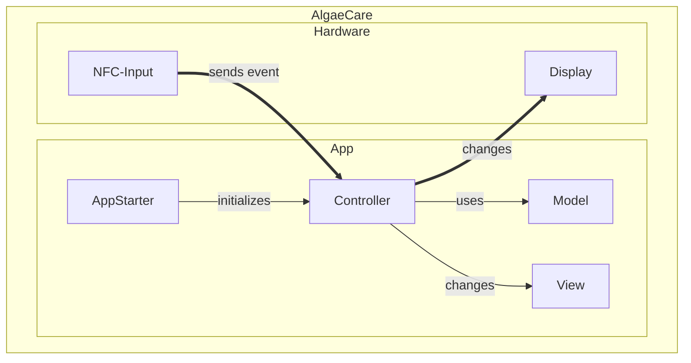

# Schnittstellen
In diesem Kapitel werden sämtliche Schnittstellen beschrieben, über die die Software mit Hardware kommuniziert.

## Simple Darstellung

Die dick markierten Linien stellen die Schnittstellen dar.
Es gibt 2 Schnittstellen:
1. NPC-Input -> Controller: Erkannte NFC Eingaben lösen ein Event aus, auf welches der controller reagiert.
2. Controller -> Display: Der Controller verändert die View Elemente und zeigt diese auf dem Display an.

## Schnittstellen im Klassendiagramm

TODO