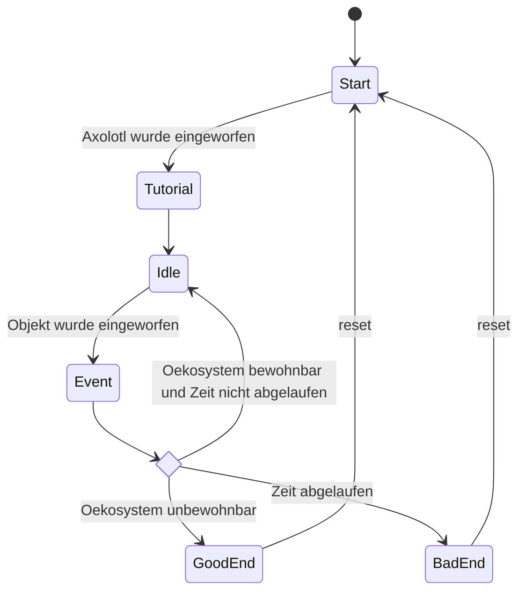

# Schnittstellen
In dieser Seite werden alle "States" (Zustände) beschrieben welches die Applikation haben kann.

1. Start:
Bei Beginn des Spiels wartet das Spiel auf den Einwurf der Axolotl Figur.
2. Tutorial:
Wird das Axolotl eingeworfen erklärt dieses kurz das Spiel.
3. Idle:
Das Axolotl schwebt im Meer, bis ein Objekt eingeworfen wird.
4. Event:
Wird ein Objekt eingeworfen, wird eine Animation und einen Text angezeigt.
5. GoodEnd:
Ist die Zeit um und das Ökosystem in gesundem Zustand, bedankt sich das Axolotl. Danach fängt man bei "Start" wieder an.
6. BadEnd:
Ist das Ökosystem unbewohnbar, flüchtet das Axolotl. Danach fängt man bei "Start" wieder an.
