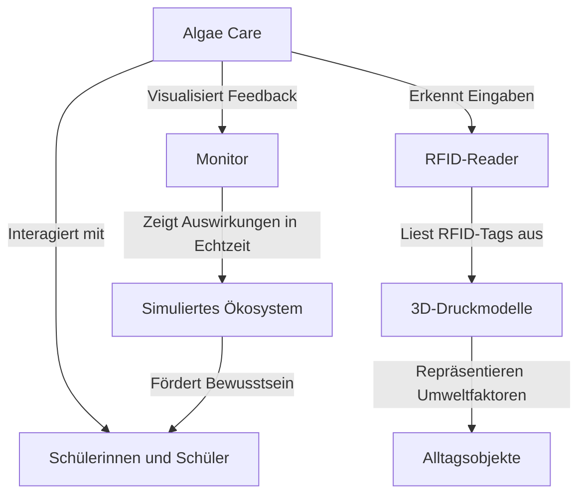

# Kontextabgrenzung

In diesem Abschnitt wird das Umfeld von Algae Care beschrieben, um die Rolle des Exponats innerhalb der Ausstellung und seine Interaktion mit der Umgebung klar zu definieren. Der Fokus liegt darauf, die Zielgruppe des Systems zu identifizieren und die Schnittstellen zu externen Systemen oder Komponenten zu beschreiben.

Die Kontextabgrenzung ermöglicht es, das Projekt besser einzuordnen, indem sie die Grenzen des Systems sowie seine Abhängigkeiten und Wechselwirkungen mit anderen Systemen oder Elementen aufzeigt. Dadurch wird sichergestellt, dass alle Beteiligten ein gemeinsames Verständnis über den Anwendungsbereich und die technischen Rahmenbedingungen des Exponats teilen.

Dieser Abschnitt beantwortet folgende Fragen:
- Für welche Benutzerinnen und Benutzer ist Algae Care vorgesehen?
- Mit welchen externen Systemen oder Komponenten interagiert das Exponat?
- Welche Rolle spielt das Exponat im Gesamtkontext der Ausstellung?

Die präzise Abgrenzung des Kontexts ist entscheidend, um die Anforderungen an das System zu definieren und dessen erfolgreiche Integration in die Ausstellung zu gewährleisten.

## Fachlicher Kontext

### Benutzer (Schülerinnen und Schüler)

Algae Care richtet sich primär an Jugendliche der 7. bis 9. Schulklasse, die das Exponat interaktiv erleben. Die Benutzer interagieren mit dem System durch haptische Eingaben wie das Platzieren von Alltagsobjekten (z. B. Plastikflaschen oder Kompost) und beobachten die Auswirkungen dieser Handlungen auf ein simuliertes Ökosystem. Diese Interaktion dient nicht nur der Wissensvermittlung, sondern soll auch das Bewusstsein für Nachhaltigkeit und Umweltschutz fördern.

### 3D-Druckmodelle (Fremdsystem)

Für die haptische Interaktion werden physische Alltagsobjekte wie Plastikflaschen oder Abfallstücke verwendet, die mithilfe von 3D-Druck erstellt werden. Diese Objekte repräsentieren verschiedene Umweltfaktoren und ermöglichen den Nutzern, durch einfache Handlungen komplexe ökologische Zusammenhänge zu verstehen. Der 3D-Druck und die Verarbeitung der Modelle erfolgen außerhalb des Systems, ihre Integration ist jedoch entscheidend für das Benutzererlebnis.

### Visualisierungssystem (Fremdsystem)

Das Feedback zu den Benutzeraktionen wird über einen angeschlossenen Monitor dargestellt. Dieses Visualisierungssystem zeigt in Echtzeit, wie die Algen auf die Eingaben der Benutzer reagieren, und veranschaulicht, ob diese Eingaben einen positiven oder negativen Einfluss auf das Ökosystem haben. Der Monitor verzichtet bewusst auf Touchscreen-Funktionen, da diese für die angestrebte Interaktion nicht erforderlich sind. Stattdessen liegt der Fokus auf der klaren und anschaulichen Darstellung der Auswirkungen.

### RFID-Reader (Fremdsystem)

Der RFID-Reader wird eingesetzt, um die 3D-gedruckten Alltagsobjekte zuverlässig zu erkennen und die Benutzerinteraktionen mit dem Exponat zu ermöglichen. Jedes Objekt ist mit einem RFID-Tag ausgestattet, das vom Reader ausgelesen wird, sobald das Objekt in das dafür vorgesehene Eingabefeld platziert wird.

Der RFID-Reader dient dabei als zentrale Schnittstelle zur Erkennung und Zuordnung der Objekte. Auf Basis der erkannten Objekte bewertet das System deren Auswirkungen auf das simulierte Ökosystem und stellt die Ergebnisse visuell auf dem Monitor dar.

Die Nutzung eines RFID-Readers bietet folgende Vorteile:
- **Robuste Erkennung:** Jedes Objekt wird eindeutig identifiziert, wodurch Fehleingaben minimiert werden.
- **Kontaktlose Bedienung:** Die Interaktion ist einfach und intuitiv, ohne dass mechanische Teile oder Sensoren verschleißen.
- **Flexibilität:** Neue Objekte können durch Hinzufügen passender RFID-Tags leicht in das System integriert werden.

Durch den Einsatz des RFID-Readers wird sichergestellt, dass die Eingaben der Benutzer präzise erkannt und korrekt verarbeitet werden, was das Nutzererlebnis verbessert und die Interaktion mit dem Exponat erleichtert.

## Technischer- oder Verteilungskontext

### Übersicht

Der technische Kontext von Algae Care beschreibt die Interaktion des Systems mit seinen Hauptkomponenten und deren Umgebung. Das System basiert auf einer modularen Architektur, die die Verarbeitung von Eingaben, die Simulation von Umweltreaktionen und die Visualisierung der Ergebnisse umfasst. Es wurde entwickelt, um sowohl robust als auch flexibel zu sein und kann unabhängig von externen Systemen betrieben werden.

### Hauptkomponenten und deren Rollen
1. **Raspberry Pi (zentrale Recheneinheit):**
- Verantwortlich für die Verarbeitung der RFID-Eingaben, die Durchführung der Simulationen und die Steuerung der visuellen Ausgaben.
- Betriebssystem: Raspberry Pi OS.
- Java 21 wird als Hauptprogrammiersprache verwendet, unterstützt durch die Pi4J-Bibliothek zur Hardwarekommunikation.
2. **RFID-Reader:**	
- Eingabegerät zur Identifikation der 3D-gedruckten Alltagsobjekte, basierend auf RFID-Tags.
- Verbindung über USB oder GPIO-Pins.
- Daten werden direkt an die zentrale Anwendung weitergeleitet.
3. **Monitor (Visualisierung):**
- Dient als Anzeige für die Simulationsergebnisse und Benutzeraktionen.
- Verbindung über HDMI, gesteuert durch die Java-Anwendung.
4. **3D-Druckobjekte mit RFID-Tags:**
- Physische Objekte, die vom Benutzer als Eingabe verwendet werden.
- Tags enthalten eindeutige Identifikationsdaten, die vom RFID-Reader gelesen werden.

### Datenfluss und Interaktion
- **Eingabe:** Benutzer platzieren ein 3D-Objekt in den vorgesehenen Bereich. Der RFID-Reader erfasst die Tag-Daten und übermittelt sie an die Anwendung.
- **Verarbeitung:** Die Anwendung interpretiert die Daten und simuliert die Auswirkungen der Eingabe auf das Ökosystem.
- **Ausgabe: **Die Ergebnisse der Simulation werden in Echtzeit auf dem Monitor visualisiert, einschließlich positiver oder negativer Auswirkungen auf die Algenpopulation.

### Externe Abhängigkeiten
- **Hardware-Kompatibilität:**	
    - Sicherstellung der Funktionalität mit Raspberry Pi 5 und Pi4J-Bibliothek. Bei Bedarf kann ein Mikrocontroller (z. B. Arduino) als Vermittler eingesetzt werden.
**Offline-Fähigkeit:**
- Das System benötigt keine Internetverbindung und ist vollständig autark.

### Technische Herausforderungen und Lösungen
- **Störungsfreiheit:** Durch die Verwendung von LF-RFID-Tags wird sichergestellt, dass benachbarte Tags nicht versehentlich ausgelesen werden.
- **Flexibilität:** Konfigurierbare Parameter (z. B. Sprache und Simulationseinstellungen) ermöglichen einfache Anpassungen über eine zentrale Konfigurationsdatei.

### Fazit

Der technische Kontext von Algae Care kombiniert robuste Hardware mit effizienter Software, um eine interaktive und benutzerfreundliche Erfahrung zu schaffen. Die Architektur gewährleistet, dass das System unabhängig von externen Ressourcen arbeitet, flexibel erweitert werden kann und gleichzeitig den spezifischen Anforderungen einer Ausstellung gerecht wird.