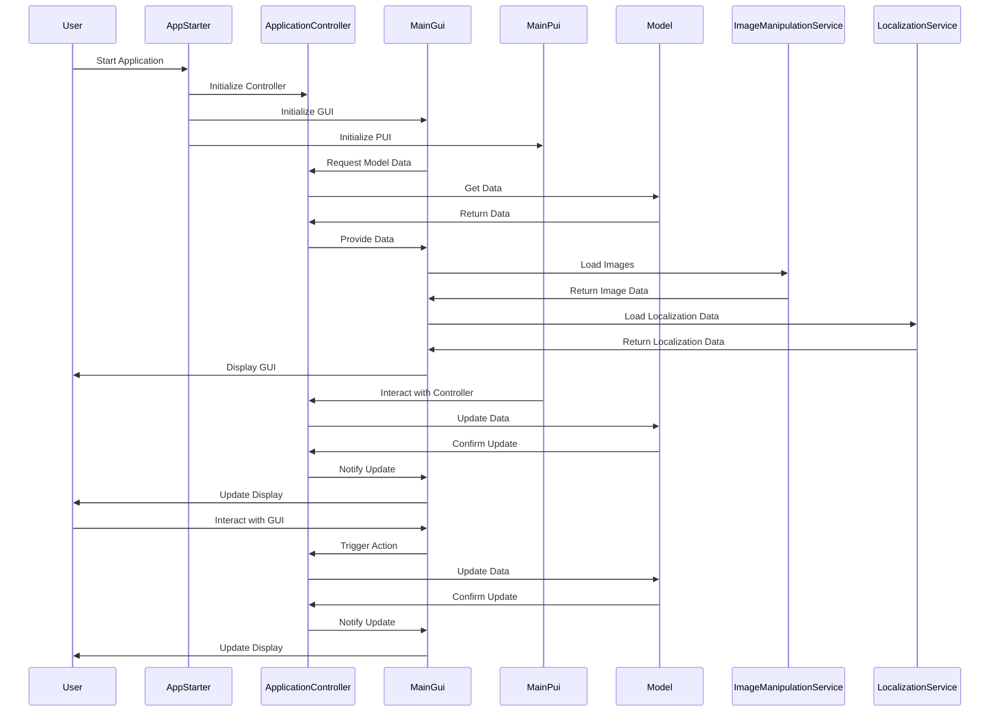

(der wichtigsten Abläufe)

# Laufzeitsicht

Die Laufzeitsicht beschreibt die dynamischen Abläufe innerhalb der Anwendung Algae Care während ihres Betriebs. Hier wird gezeigt, wie die einzelnen Komponenten zusammenarbeiten, um Benutzerinteraktionen zu verarbeiten, Daten zu verwalten und Ergebnisse darzustellen. Das folgende Sequenzdiagramm illustriert die wichtigsten Abläufe, vom Start der Anwendung bis zur Interaktion mit dem Benutzer.

## Sequenzdiagramm

## Beschreibung der Abläufe

1. **Start der Anwendung:**
- Der Benutzer startet die Anwendung, indem er den **AppStarter** ausführt.
- Der **AppStarter** initialisiert die Hauptkomponenten:
    - Den **ApplicationController** für die Steuerung der Logik.
    - Die **MainGui** für die Benutzeroberfläche.
    - Die **MainPui** für die physische Benutzerinteraktion.
2. **Initialisierung der GUI:**
- Die **MainGui** fordert Daten vom ApplicationController an.
- Der **ApplicationController** holt die erforderlichen Daten aus dem **Model** und gibt diese an die GUI zurück.
- Zusätzliche Ressourcen wie Bilder und Lokalisierungsdaten werden durch den **ImageManipulationService** und den **LocalizationService** geladen.
3. **Anzeigen der Benutzeroberfläche:**
- Die **MainGui** zeigt die initialisierten Daten und Ressourcen dem Benutzer an.
4. **Benutzerinteraktionen:**
- Der Benutzer interagiert mit der GUI oder der PUI.
- Die **MainPui** oder die **MainGui** übermittelt Aktionen an den **ApplicationController**, der entsprechende Daten im **Model** aktualisiert.
- Änderungen im Model werden zurück an die GUI übermittelt, die die Anzeige aktualisiert.
5. **Dynamische Updates:**
- Jede Benutzeraktion, ob durch die GUI oder die PUI, wird verarbeitet und führt zu einer Aktualisierung der Daten im **Model** und einer erneuten Darstellung der Ergebnisse in der **MainGui**.

## Fazit

Die Laufzeitsicht zeigt den reibungslosen Ablauf zwischen den Komponenten von Algae Care und ihre Zusammenarbeit, um eine intuitive Benutzererfahrung zu gewährleisten. Durch klare Trennung der Verantwortlichkeiten und modulare Services wird die Wartbarkeit und Erweiterbarkeit der Anwendung unterstützt.