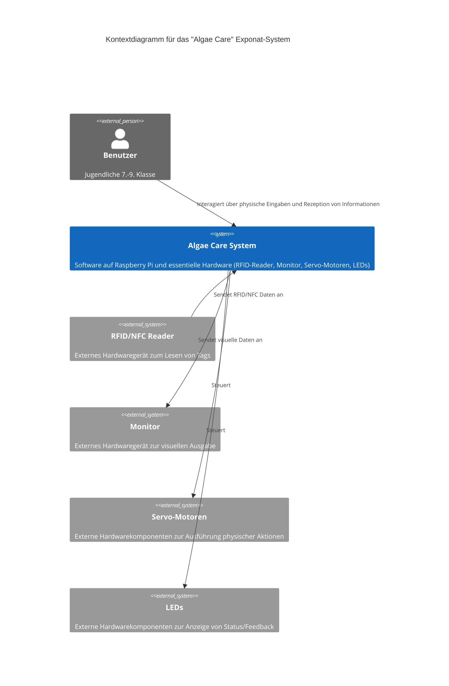

Dieser Abschnitt beschreibt die Einordnung des Systems in seine Umgebung. Er zeigt die direkten Nachbarn des Systems (Benutzer, andere Systeme, Hardware) und die Schnittstellen zu diesen Nachbarn. Zudem wird die Systemgrenze klar gezogen und der funktionale Umfang (Scope) des Systems definiert.

### 3.1 Kontextdiagramm (Beschreibung)

Das "Algae Care" Exponat-System kann in seiner Umgebung wie folgt beschrieben werden:

Dieses System interagiert direkt mit folgenden externen Entitäten:

* **Benutzer (Jugendliche 7.-9. Klasse):** Die Benutzer sind die primären Akteure, die mit dem System interagieren. Ihre Interaktion erfolgt über physische Eingaben und die Rezeption von Informationen.
* **RFID/NFC Reader:** Ein externes Hardwaregerät, das physisch mit dem System verbunden ist und Eingaben von den 3D-gedruckten Objekten liest.
* **Monitor:** Ein externes Hardwaregerät, das physisch mit dem System verbunden ist und visuelle Ausgaben des Systems darstellt.
* **Servo-Motoren:** Externe Hardwarekomponenten, die vom System gesteuert werden, um physische Aktionen im Exponat auszuführen (z.B. Öffnen einer Klappe).
* **LEDs:** Externe Hardwarekomponenten, die vom System gesteuert werden, um visuelles Feedback oder Statusinformationen anzuzeigen.

Die 3D-gedruckten Objekte mit RFID/NFC-Tags sind das *Medium* der Benutzerinteraktion, werden aber vom RFID-Reader gelesen und sind nicht direkt eine "Nachbarsystem"-Entität des Softwaresystems im Sinne eines laufenden Systems oder Geräts, das *mit* dem Softwaresystem kommuniziert. Ihre Erstellung liegt ausserhalb des Scopes des Algae Care Systems.

Die Konfigurations-Hardware (Maus/Tastatur) ist ebenfalls extern, wird aber eher für die Wartung und Konfiguration verwendet und ist nicht Teil der Laufzeit-Interaktion im Kontextdiagramm.

### 3.2 Externe Schnittstellen

Die Schnittstellen des "Algae Care" Systems zu seiner Umgebung sind:

* **Benutzerschnittstelle (UI):**
    * **Eingabe (Haptisch/Physisch):** Benutzer interagieren durch das Einlegen von 3D-gedruckten Objekten in einen Eingabetrichter und möglicherweise durch die Bedienung eines Hebels (basierend auf früheren Feature-Beschreibungen). Die physischen Objekte fungieren als Eingabe-Trigger, die vom RFID/NFC Reader interpretiert werden.
    * **Ausgabe (Visuell):** Das System kommuniziert visuell über den angeschlossenen Monitor. Hier werden die Simulation des Ökosystems, die Auswirkungen der Benutzereingaben und ggf. Umweltwerte (Sauerstoffgehalt, Temperatur, pH-Wert - basierend auf F02.2) dargestellt. Der Monitor dient ausschliesslich der Anzeige.
    * **Ausgabe (Akustisch):** Das System kann Töne oder Erklärungen über Lautsprecher ausgeben (basierend auf F02.3).
    * **Ausgabe (Visuell/Status):** LEDs (F01.1) zeigen den Zustand des Algensystems an (blau, rot, weiss).
* **Hardwareschnittstellen:**
    * **RFID/NFC Reader Interface:** Schnittstelle zum Auslesen der Tags auf den 3D-Objekten. Die Verbindung erfolgt voraussichtlich über USB oder GPIO-Pins des Raspberry Pi. Das System empfängt Daten, die das identifizierte Objekt repräsentieren.
    * **Monitor Interface:** Schnittstelle zur Steuerung der Anzeige auf dem Monitor. Die Verbindung erfolgt über HDMI. Das System sendet Grafikdaten und Informationen zur Darstellung der Simulation und Umweltwerte.
    * **Servo Motor Interface:** Schnittstelle zur Ansteuerung der Servo-Motoren. Die Verbindung erfolgt voraussichtlich über GPIO-Pins des Raspberry Pi. Das System sendet Steuersignale, um die Motoren zu bewegen.
    * **LED Interface:** Schnittstelle zur Ansteuerung der LEDs. Die Verbindung erfolgt voraussichtlich über GPIO-Pins des Raspberry Pi. Das System sendet Signale zur Steuerung von Farbe und Zustand der LEDs.
* **Konfigurations-/Wartungsschnittstelle:** Eine separate Schnittstelle, wahrscheinlich über USB-Anschlüsse, ermöglicht den Anschluss von Maus und Tastatur (F05) zur direkten Interaktion mit dem zugrundeliegenden Betriebssystem des Raspberry Pi und den Zugriff auf Konfigurationsdateien (`app.properties`).

### 3.3 Abgrenzung (Scope)

Der Scope des "Algae Care" Systems umfasst:

* Die Software, die auf dem Raspberry Pi läuft und für die Verarbeitung der RFID-Eingaben, die Durchführung der Simulation, die Steuerung der Ausgabegeräte (Monitor, Servos, LEDs) und die Verwaltung der Konfiguration zuständig ist.
* Die direkt an den Raspberry Pi angeschlossene Hardware, die für die Kernfunktionalität des Exponats benötigt wird: der RFID/NFC Reader, der Monitor, die Servo-Motoren und die LEDs.

Explizit **ausserhalb** des Scopes liegen:

* Die Benutzer selbst.
* Die physischen 3D-gedruckten Alltagsobjekte mit RFID/NFC-Tags (ihre Erstellung und physische Existenz sind ausserhalb, ihre Interaktion mit dem Reader ist die Schnittstelle).
* Die externe Stromversorgung des Exponats und der Komponenten.
* Das physikalische Gehäuse des Exponats, auch wenn dessen Design die technischen Anforderungen beeinflusst (Transportierbarkeit, Wartbarkeit, physische Integration der Komponenten).
* Die Werkzeuge, die für die Wartung benötigt werden.
* Die Primeo Energie Infrastruktur oder andere externe IT-Systeme, da das System offline betrieben wird.