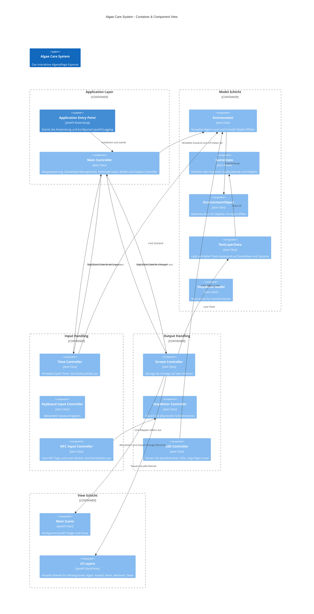
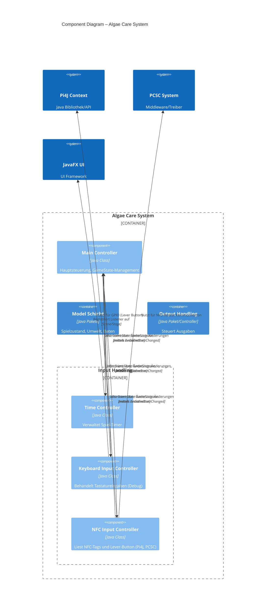
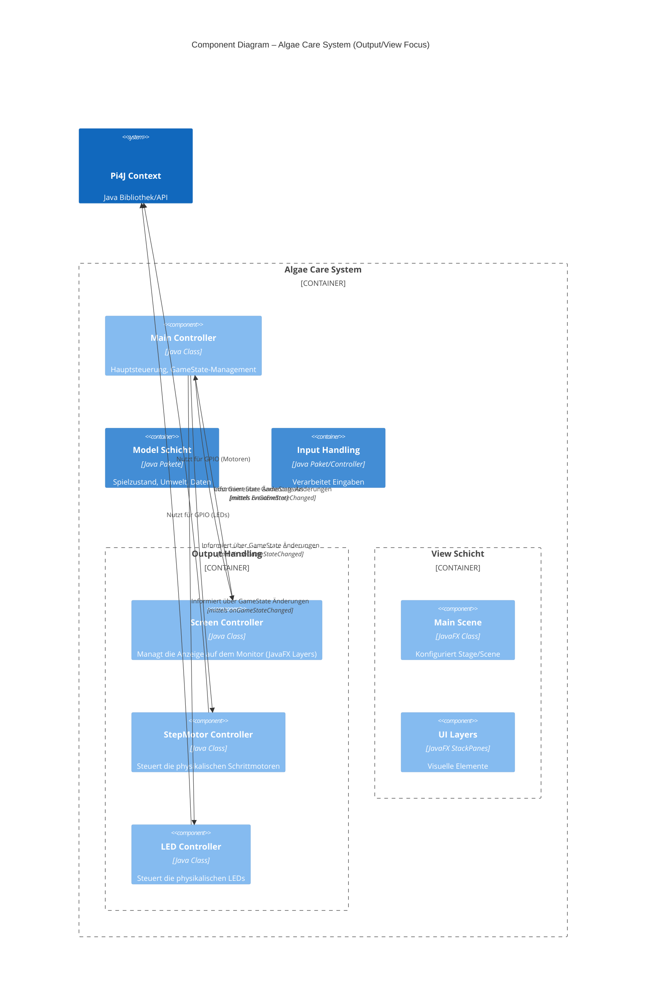
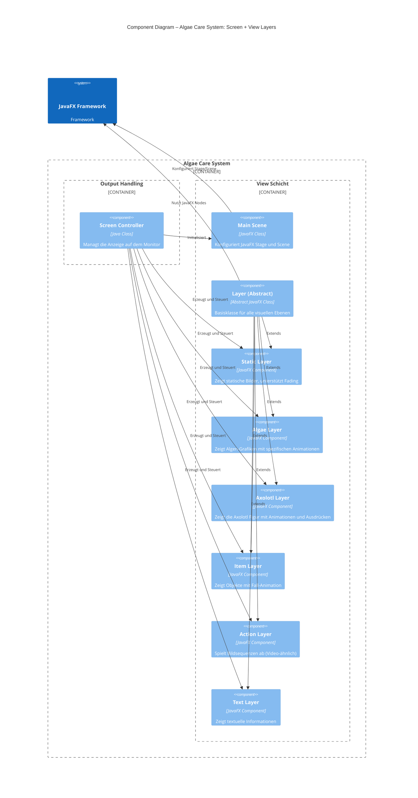
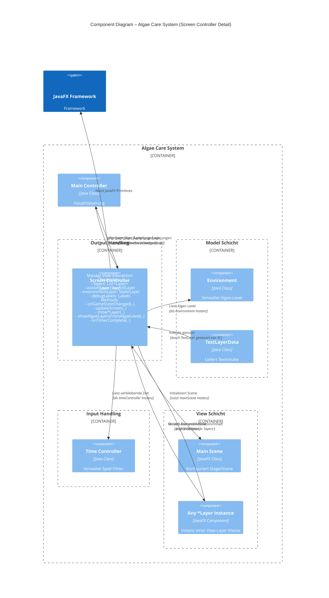
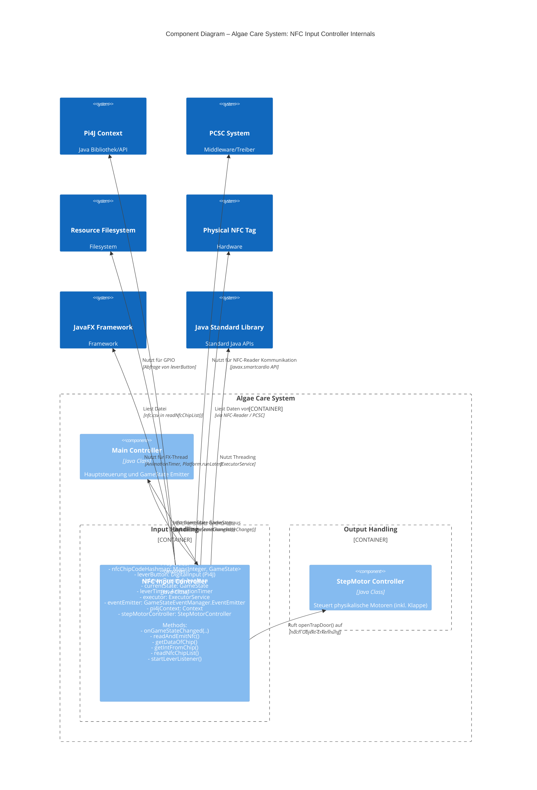

Die Bausteinsicht zeigt die statische Zerlegung des Systems in Bausteine (Module, Komponenten, Subsysteme, Klassen, Schnittstellen, Pakete, Bibliotheken, Frameworks, Schichten, Partitionen, Tiers, Funktionen, Makros, Operationen, Datenstrukturen, ...) sowie deren Abhängigkeiten (Beziehungen, Assoziationen, ...).

Diese Sicht ist für jede Architekturdokumentation obligatorisch. In Analogie zu einem Haus ist dies der Grundriss.

## 5.1 Whitebox Gesamtsystem (Level 1)

Dies ist eine Whitebox-Sicht auf das "Algae Care System" (Container/Komponenten-Ebene), das die wichtigsten internen Bausteine und ihre Beziehungen zeigt.

**Motivation der Zerlegung:**

Die Zerlegung des Systems in diese Bausteine folgt primär einer Trennung der Belange (Separation of Concerns), ähnlich dem Model-View-Controller (MVC) Muster, ergänzt um spezifische Controller für Input/Output-Hardware.

  * **Trennung von Logik, Daten und Darstellung:** Das Model enthält die reinen Daten und die Spiellogik (Algen-Level, Objekt-Effekte), während View nur für die Darstellung zuständig ist. Die Controller vermitteln dazwischen.
  * **Abstraktion von Hardware-Interaktion:** Die Controller für NFC, Motoren und LEDs kapseln die spezifische Hardware-Kommunikation (Pi4J, PCSC), was den Rest des Systems hardwareunabhängiger macht.
  * **Modularität für Input/Output:** Separate Controller für verschiedene Input- und Output-Kanäle (Keyboard, NFC, Timer, Screen, Motoren, LEDs) ermöglichen das einfache Hinzufügen oder Ändern einzelner Interaktionsmethoden.
  * **Zustandsbasiertes Verhalten:** Der MainController und das GameState Enum bilden das Zentrum der Steuerung, wodurch das Systemverhalten klar an den aktuellen Spielzustand gekoppelt ist.
  * **Testbarkeit:** Die Trennung ermöglicht potenziell das Testen einzelner Controller oder des Models isoliert von der Hardware oder der UI (erkennbar an den Testdateien).

**Beschreibung der enthaltenen Bausteine (Blackboxes):**

| Name                      | Verantwortung                                                                                                 | Wichtige Schnittstellen / Interaktionen                                                                                                                            | Ort im Code             |
| :------------------------ | :------------------------------------------------------------------------------------------------------------ | :----------------------------------------------------------------------------------------------------------------------------------------------------------------- | :---------------------- |
| Application Entry Point   | Startet die JavaFX-Anwendung, konfiguriert Logging und System-Properties, instanziiert den Main Controller.     | Startpunkt der Anwendung. Ruft MainController auf.                                                                                                                 | `com.algaecare.app.Main`  |
| Main Controller           | Zentrale Steuerung des Spielablaufs. Verwaltet den aktuellen GameState. Verbindet und koordiniert die anderen Controller und das Model. | Implementiert `GameStateEventManager.EventEmitter` (löst Zustandsänderungen aus). Registriert andere Controller als `GameStateEventManager` Listener.                 | `com.algaecare.controller.MainController` |
| Model Schicht             | Enthält alle Daten und die reine Spiellogik, unabhängig von Input/Output/View.                                 | Stellt Zustand (`Environment`, `GameState`) und Daten (`TextLayerData`) bereit. Enthält Logik zur Zustandsaktualisierung.                                          | `com.algaecare.model.*` |
| Input Handling            | Verantwortlich für das Erfassen und Interpretieren von externen und internen Eingaben.                          | Empfängt physische Eingaben (Keyboard, NFC-Reader, Hebel) und Zeitereignisse. Informiert den MainController über GameState-Änderungen.                              | `com.algaecare.controller.input.*` |
| Output Handling           | Verantwortlich für die Steuerung aller Ausgabekanäle (Monitor, LEDs, Motoren).                                  | Empfängt GameState-Änderungen und aktualisiert entsprechend die View-Elemente, LEDs und Motoren. Löst ggf. Zustandsänderungen nach Aktionen aus.                   | `com.algaecare.controller.output.*` |
| View Schicht              | Verantwortlich für die visuelle Darstellung des Spiels auf dem Monitor mittels JavaFX.                          | Besteht aus verschiedenen Layer-Elementen, die vom `ScreenController` manipuliert werden, um den aktuellen Spielzustand anzuzeigen.                             | `com.algaecare.view.*` |

**Wichtige Schnittstellen:**

  * **`GameStateEventManager` und `GameStateEventManager.EventEmitter`:** Dieses Interface-Paar ist zentral für die Kommunikation zwischen den Controllern und dem MainController.
      * `GameStateEventManager`: Definiert die Methode `onGameStateChanged(GameState oldState, GameState newState)`, die von Listenern implementiert wird, um auf Zustandsänderungen zu reagieren. Jeder Controller, der auf den Spielzustand reagieren muss, implementiert dies.
      * `GameStateEventManager.EventEmitter`: Definiert die Methode `emitGameStateChange(GameState newState)`, die vom `MainController` implementiert wird und von Input/Output Controllern aufgerufen wird, um eine Zustandsänderung im System anzufordern.

### 5.2 Level 2

Hier werden die inneren Strukturen ausgewählter Bausteine von Level 1 als Whiteboxes spezifiziert. Wir haben uns entschieden, die Bausteine "Input Handling" und "Output Handling" detaillierter zu betrachten, da sie zentrale Interaktionen mit dem System und externen Elementen kapseln.

#### 5.2.1 White Box: Input Handling

Diese Ansicht zeigt die internen Komponenten des "Input Handling" Containers und wie sie untereinander sowie mit Elementen ausserhalb dieses Containers interagieren.

**Blackbox-Beschreibungen der Komponenten im "Input Handling" Container:**

**Time Controller**

  * **Purpose/Responsibility:** Verwaltet den Spiel-Timer. Zählt die verbleibende Spielzeit herunter und löst am Ende des Timers, basierend auf dem aktuellen Algen-Level, den entsprechenden Endbildschirm-Zustand aus.
  * **Interface(s):**
      * Implementiert `GameStateEventManager`: `onGameStateChanged(GameState oldState, GameState newState)` (reagiert auf `GAMEPLAY` zum Starten, `TITLE` zum Zurücksetzen).
      * Nutzt `GameStateEventManager.EventEmitter`: `emitGameStateChange(GameState newState)` (sendet Endscreen-Zustände an MainController).
      * Benötigt `Environment` Instanz (zum Abfragen des Algen-Levels am Spielende).
      * Intern: Nutzt JavaFX `Timeline` für den Timer-Mechanismus.
  * **(Optional) Directory/File Location:** `src/main/java/com/algaecare/controller/input/TimeController.java`

**Keyboard Input Controller**

  * **Purpose/Responsibility:** Verarbeitet Tastatureingaben. Dient hauptsächlich zu Debugging- und Entwicklungszwecken, um GameStates über Tastenanschläge auszulösen, die normalerweise durch NFC-Objekte oder Timer-Ereignisse ausgelöst würden.
  * **Interface(s):**
      * Implementiert `GameStateEventManager`: `onGameStateChanged(GameState oldState, GameState newState)` (speichert den aktuellen Zustand, um Eingaben kontextabhängig zu verarbeiten).
      * Nutzt `GameStateEventManager.EventEmitter`: `emitGameStateChange(GameState newState)` (sendet ausgelöste GameStates an MainController).
      * Benötigt JavaFX `Stage` (zum Registrieren von Event-Handlern auf der Scene).
  * **(Optional) Directory/File Location:** `src/main/java/com/algaecare/controller/input/KeyboardInputController.java`

**NFC Input Controller**

  * **Purpose/Responsibility:** Liest NFC/RFID-Tags und den Zustand des physischen Hebels. Übersetzt gelesene Tag-IDs in `GameState`-Zustände basierend auf einer Konfigurationsdatei. Löst die Fallen-Klappen-Aktion aus, wenn ein Objekt eingeworfen wird.
  * **Interface(s):**
      * Implementiert `GameStateEventManager`: `onGameStateChanged(GameState oldState, GameState newState)` (reagiert auf Zustandsänderungen, um den Hebelstatus zurückzusetzen und die Klappe zu öffnen).
      * Nutzt `GameStateEventManager.EventEmitter`: `emitGameStateChange(GameState newState)` (sendet den GameState des gelesenen Objekts an MainController).
      * Benötigt `Pi4J Context` Instanz (für den Zugriff auf GPIO Pin des Hebels).
      * Benötigt `StepMotorController` Instanz (zum Aufrufen der `openTrapDoor`-Methode).
      * Interagiert mit PCSC-System (für NFC-Reader-Kommunikation).
      * Intern: Nutzt `ExecutorService` für asynchrones NFC-Lesen, JavaFX `AnimationTimer` für Hebel-Polling.
  * **(Optional) Directory/File Location:** `src/main/java/com/algaecare/controller/input/NFCInputController.java`

#### 5.2.2 White Box: Output Handling

Diese Ansicht zeigt die internen Komponenten des "Output Handling" Containers und wie sie untereinander sowie mit Elementen ausserhalb dieses Containers interagieren.

**Blackbox-Beschreibungen der Komponenten im "Output Handling" Container:**

**Screen Controller**

  * **Purpose/Responsibility:** Ist für die gesamte visuelle Ausgabe auf dem Monitor verantwortlich. Lädt und verwaltet die verschiedenen visuellen Ebenen (`*Layer`) und schaltet diese basierend auf dem aktuellen `GameState` ein/aus, passt ihre Inhalte an und startet Animationen. Aktualisiert Debug-Informationen auf dem Bildschirm.
  * **Interface(s):**
      * Implementiert `GameStateEventManager`: `onGameStateChanged(GameState oldState, GameState newState)` (die zentrale Methode, die den Screen basierend auf dem neuen Zustand aktualisiert).
      * Nutzt `GameStateEventManager.EventEmitter`: `emitGameStateChange(GameState newState)` (sendet Zustandsänderungen z.B. nach dem Ende einer Animation an MainController).
      * Benötigt `Stage` (wird an `MainScene` übergeben).
      * Benötigt `Environment` Instanz (zum Abfragen des Algen-Levels).
      * Benötigt `TimeController` Instanz (zum Abfragen der verbleibenden Zeit für Debug-Anzeige).
      * Nutzt die Klassen im `com.algaecare.view` Paket.
  * **(Optional) Directory/File Location:** `src/main/java/com/algaecare/controller/output/ScreenController.java`
  * **(Optional) Open issues/problems/risks:** Die Logik zum Ein-/Ausblenden der verschiedenen Layer in `updateScreen` ist komplex und potenziell fehleranfällig bei neuen Zuständen oder Übergängen.

**Step Motor Controller**

  * **Purpose/Responsibility:** Steuert die physikalischen Schrittmotoren, die für die O2/CO2-Anzeigen und die Fallen-Klappe verwendet werden. Passt die Position der Anzeigen basierend auf dem Algen-Level an und öffnet/schliesst die Klappe bei Bedarf.
  * **Interface(s):**
      * Implementiert `GameStateEventManager`: `onGameStateChanged(GameState oldState, GameState newState)` (reagiert auf Zustandsänderungen, um die Anzeige-Motoren basierend auf dem Algen-Level zu positionieren).
      * Bietet öffentliche Methode: `openTrapDoor()` (wird vom `NFCInputController` aufgerufen).
      * Benötigt `Environment` Instanz (zum Abfragen des Algen-Levels).
      * Benötigt `Pi4J Context` Instanz (für die Steuerung der GPIO Pins der Motoren via `StepMotor` Modell).
      * Nutzt die Klasse `StepMotor` (Modell für einen Schrittmotor).
  * **(Optional) Directory/File Location:** `src/main/java/com/algaecare/controller/output/StepMotorController.java`
  * **(Optional) Quality-/Performance characteristics:** Die Genauigkeit der Anzeigen hängt von der Kalibrierung der Schrittzähler ab. Die Geschwindigkeit der Motorbewegungen (besonders der Klappe) beeinflusst das Benutzererlebnis und die Robustheit.

**LED Controller**

  * **Purpose/Responsibility:** Steuert die physikalischen LEDs, die wahrscheinlich das Algen-Level visuell anzeigen (z.B. eine Leiste). Passt die Anzahl der leuchtenden LEDs basierend auf dem aktuellen Algen-Level an.
  * **Interface(s):**
      * Implementiert `GameStateEventManager`: `onGameStateChanged(GameState oldState, GameState newState)` (reagiert auf Zustandsänderungen, um die LEDs basierend auf dem Algen-Level zu aktualisieren).
      * Benötigt `Environment` Instanz (zum Abfragen des Algen-Levels).
      * Benötigt `Pi4J Context` Instanz (für die Steuerung der GPIO Pins der LEDs).
  * **(Optional) Directory/File Location:** `src/main/java/com/algaecare/controller/output/LedController.java`

#### 5.2.3 White Box: View Schicht

Diese Ansicht zeigt die internen Komponenten des "View Schicht" Containers, die primär für die visuelle Darstellung zuständig sind. Die Logik, die diese Komponenten *steuert*, liegt im `ScreenController` im "Output Handling".

**Blackbox-Beschreibungen der Komponenten in der "View Schicht":**

**Main Scene**

  * **Purpose/Responsibility:** Konfiguriert das Hauptfenster der Anwendung (`Stage`) und erstellt die grundlegende Szenenstruktur (`Scene`, `StackPane`) mit den festgelegten Abmessungen und Eigenschaften (Vollbild, undekoriert).
  * **Interface(s):**
      * Benötigt eine JavaFX `Stage` Instanz.
      * Bietet eine Methode `getScene()`, um die erstellte Szene zurückzugeben.
  * **(Optional) Directory/File Location:** `src/main/java/com/algaecare/view/MainScene.java`

**Layer (Abstract)**

  * **Purpose/Responsibility:** Bietet eine gemeinsame Basisklasse für alle spezifischen visuellen Ebenen (`*Layer`). Erweitert `javafx.scene.layout.StackPane`, um Layout-Fähigkeiten bereitzustellen. Definiert grundlegende Methoden zum Ein- und Ausblenden (setzen der Sichtbarkeit).
  * **Interface(s):**
      * Erbt von `javafx.scene.layout.StackPane`.
      * Definiert öffentliche Methoden: `showLayer()`, `hideLayer()`.
  * **(Optional) Directory/File Location:** `src/main/java/com/algaecare/view/Layer.java`

**Spezifische Layer Komponenten**
(Static Layer, Algae Layer, Axolotl Layer, Item Layer, Action Layer, Text Layer)

  * **Purpose/Responsibility:** Jede spezifische Layer-Klasse ist für die Darstellung eines bestimmten visuellen Inhalts oder Effekts verantwortlich (z.B. statische Hintergründe, animierte Algen, Textfelder, Objekt-Animationen). Sie kapseln die JavaFX-Details zur Darstellung dieses Inhalts und implementieren spezifische Animationen oder Verhaltensweisen, die für ihren Zweck nötig sind. Sie werden vom `ScreenController` instanziiert und gesteuert.
  * **Interface(s):**
      * Erben von der abstrakten Klasse `Layer`.
      * Implementieren die Methoden `showLayer()` und `hideLayer()` (oft mit spezifischen Animationen wie Fading oder Skalierung).
      * Verfügen über Konstruktoren zum Laden ihrer Inhalte (Bilder, Positionen, Texte).
      * Einige Layer bieten zusätzliche, spezifische Methoden (z.B. `setExpression()` für `AxolotlLayer`, `setTargetOpacity()` für `StaticLayer`, `setOnAnimationComplete()` für `ItemLayer` und `ActionLayer`).
      * `TextLayer` nutzt `TextLayerData` aus dem Model, um den anzuzeigenden Text abzurufen.
  * **(Optional) Directory/File Location:** `src/main/java/com/algaecare/view/` gefolgt vom jeweiligen Klassennamen (`StaticLayer.java`, `AlgaeLayer.java`, etc.)

## 5.3 Level 3

Auf dieser Ebene (Level 3) zoomen wir in ausgewählte Bausteine aus Level 2 hinein, um ihre innere Struktur, ihre Schlüsselattribute und -methoden sowie ihr detailliertes Zusammenspiel mit anderen Komponenten, externen Systemen und Frameworks genauer zu betrachten. Speziell betrachten wir hier den **`ScreenController`** (aus dem "Output Handling" Container) und den **`NFCInputController`** (aus dem "Input Handling" Container), da diese aufgrund ihrer Interaktionen mit Hardware, UI oder komplexer Logik von besonderem Interesse sind.

### 5.3.1 White Box: Screen Controller

Diese Ansicht zeigt die wichtigsten internen Bestandteile (Attribute/Dependencies) des `ScreenController`s und wie dieser mit anderen Systemkomponenten und den View-Layern interagiert, um die Anzeige zu steuern.

**Blackbox-Beschreibung des Screen Controllers:**

**Screen Controller**

  * **Purpose/Responsibility:** Der `ScreenController` ist das Herzstück der visuellen Ausgabe. Er ist dafür verantwortlich, den aktuellen Spielzustand (repräsentiert durch das `GameState` Enum und Daten aus dem `Environment`) in die korrekte visuelle Darstellung auf dem Monitor zu übersetzen. Er instanziiert alle notwendigen `*Layer`-Objekte, organisiert sie auf der JavaFX `Scene` und steuert ihre Sichtbarkeit, Animationen und Inhalte basierend auf den vom `MainController` empfangenen `GameState`-Änderungen. Er zeigt auch Debug-Informationen an und löst GameState-Änderungen aus, wenn bestimmte Animationen abgeschlossen sind (z.B. nach einem Item-Drop oder am Ende der Endscreens).
  * **Interface(s):**
      * Implementiert `GameStateEventManager`: Die Methode `onGameStateChanged(GameState oldState, GameState newState)` ist der Haupteingangspunkt für die Steuerung des Bildschirms.
      * Nutzt `GameStateEventManager.EventEmitter` (als `stateEmitter`-Attribut): Ruft `emitGameStateChange(GameState newState)` auf, um den Spielzustand zu ändern, z.B. nach Beendigung einer Aktion oder Animation.
      * Benötigt Instanzen von:
          * `Stage` (wird an `MainScene` übergeben)
          * `Environment` (liest das Algen-Level)
          * `TimeController` (liest die verbleibende Zeit für Debug-Anzeige)
          * Die verschiedenen konkreten `*Layer`-Klassen (instanziiert und gesteuert)
      * Interagiert mit der `MainScene` (erhält die `Scene`, auf der die Layer platziert werden).
      * Nutzt intensiv JavaFX-APIs für Animationen (`Timeline`, `KeyFrame`, `KeyValue`), Bildverwaltung (`ImageView`, `Image`), Layout (`StackPane`), Text (`Label`, `Font`) und Event-Handling (Callbacks für Animationen).
      * Greift indirekt auf `TextLayerData` zu, indem es `TextLayer`-Instanzen mit GameState-IDs erstellt, die dann intern die Textdaten laden.
  * **(Optional) Quality-/Performance characteristics:** Die Performance hängt stark von der Effizienz der JavaFX-Renderer auf der Zielplattform (Raspberry Pi) und der Komplexität der Animationen und der Anzahl gleichzeitig sichtbarer Layer ab. Caching (`setCache(true)`) wird verwendet, um die Rendering-Leistung zu verbessern.
  * **(Optional) Directory/File Location:** `src/main/java/com/algaecare/controller/output/ScreenController.java`
  * **(Optional) Open issues/problems/risks:** Die Logik in `updateScreen` mit den vielen `switch`-Statements und der manuellen Steuerung von Layer-Sichtbarkeit und Animationen kann bei komplexeren Abläufen oder neuen GameStates unübersichtlich und fehleranfällig werden. Die Verwaltung der Listen `allAlgaeLayers`, `hiddenAlgaeLayers`, `shownAlgaeLayers` erfordert Sorgfalt, um Inkonsistenzen zu vermeiden.

### 5.3.2 White Box: NFC Input Controller

Diese Ansicht zeigt die wichtigsten internen Bestandteile (Attribute/Dependencies) des `NFCInputController`s und wie dieser mit verschiedenen externen Input-Quellen sowie anderen Systemkomponenten interagiert.

**Blackbox-Beschreibung des NFC Input Controllers:**

**NFC Input Controller**

  * **Purpose/Responsibility:** Der `NFCInputController` ist für die Erkennung von Benutzerinteraktionen über physische Objekte mit NFC-Tags und einen separaten Hebel-Button zuständig. Er liest die IDs der NFC-Tags, sobald der Hebel betätigt wird, ordnet diese IDs vordefinierten `GameState`-Zuständen zu und löst entsprechende Zustandsänderungen im System aus. Zusätzlich steuert er die Fallen-Klappe am Exponat, die nach dem Einwurf eines Objekts geöffnet wird.
  * **Interface(s):**
      * Implementiert `GameStateEventManager`: Die Methode `onGameStateChanged(GameState oldState, GameState newState)` wird genutzt, um auf Zustandsänderungen im Spiel zu reagieren, insbesondere um den Hebelstatus zurückzusetzen und die Fallen-Klappe über den `StepMotorController` zu öffnen.
      * Nutzt `GameStateEventManager.EventEmitter` (als `eventEmitter`-Attribut): Ruft `emitGameStateChange(GameState newState)` auf, um dem `MainController` mitzuteilen, welcher `GameState` durch einen erfolgreich gelesenen NFC-Tag ausgelöst wurde.
      * Benötigt eine Instanz des `Pi4J Context`: Wird für die Initialisierung und das Auslesen des digitalen Input-Pins für den Hebel benötigt.
      * Benötigt eine Instanz des `StepMotorController`: Ruft dessen Methode `openTrapDoor()` auf.
      * Interagiert mit dem externen PCSC-System über die Java-API `javax.smartcardio`, um mit dem NFC-Reader zu kommunizieren und Tag-Daten zu lesen.
      * Liest die Konfigurationsdatei `nfc.csv` aus den Ressourcen, um die Zuordnung von NFC-IDs zu GameStates zu laden.
      * Nutzt JavaFX `AnimationTimer` für das Polling des Hebel-Buttons im UI-Thread.
      * Nutzt Java `ExecutorService` für das asynchrone Ausführen des (potenziell blockierenden) NFC-Lese-Vorgangs in einem separaten Thread.
  * **(Optional) Quality-/Performance characteristics:** Die Reaktionszeit auf die Hebelbetätigung und das NFC-Lesen ist kritisch für das Benutzererlebnis. Der Entprell-Mechanismus für den Hebel und die asynchrone Verarbeitung des NFC-Lesens sind wichtig, um Zuverlässigkeit und Responsivität zu gewährleisten. Die Abhängigkeit von externer Hardware und deren Treibern (PCSC, Pi4J) birgt Betriebsrisiken.
  * **(Optional) Directory/File Location:** `src/main/java/com/algaecare/controller/input/NFCInputController.java`
  * **(Optional) Open issues/problems/risks:** Fehlerbehandlung bei nicht verfügbarem NFC-Reader (PCSC-System nicht gestartet, Reader nicht angeschlossen), Lesefehlern des Tags oder Problemen mit dem Hebel-Pin. Die Abhängigkeit von der genauen Struktur und dem Speicherort der `nfc.csv` Konfigurationsdatei.