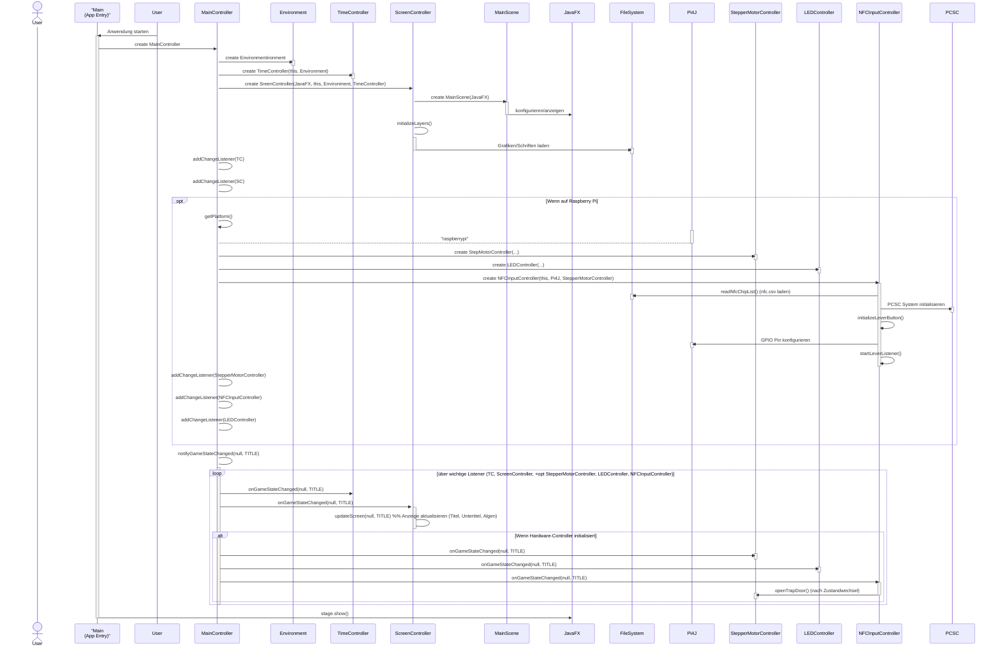
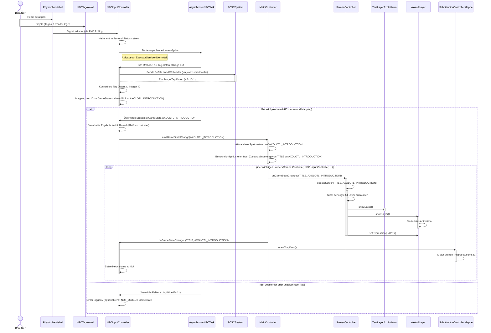
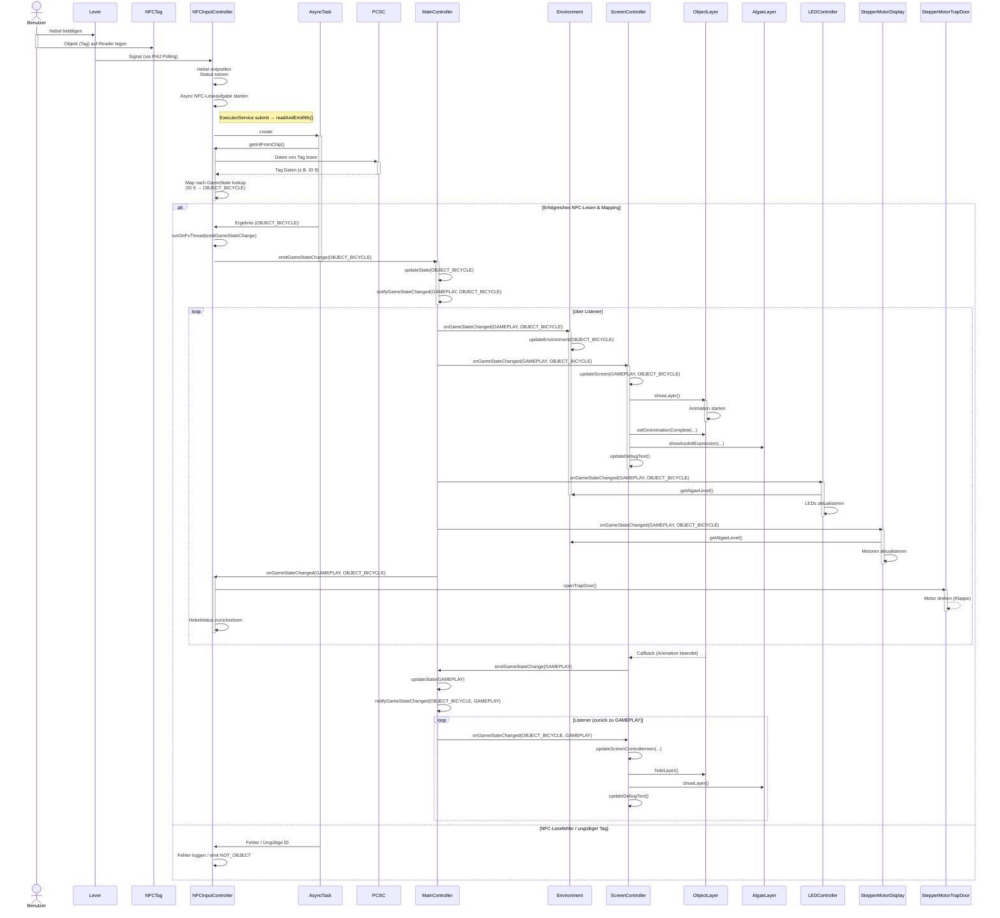
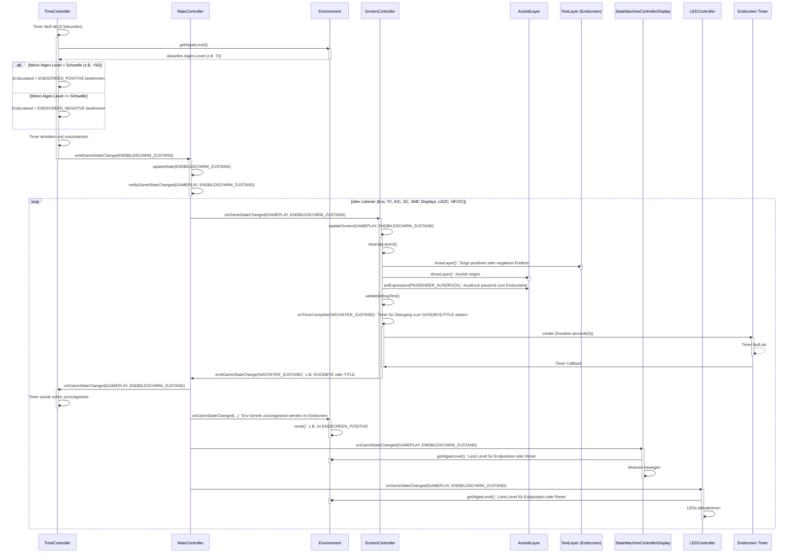

Die Laufzeitsicht beschreibt konkretes Verhalten und Interaktionen der Baustein-Instanzen des Systems in Form von Szenarien. Wir konzentrieren uns auf eine repräsentative Auswahl wichtiger Abläufe, um zu verdeutlichen, wie die Bausteine zur Laufzeit zusammenarbeiten.

## 6.1 Szenario: Systemstart und Anzeige des Titelbildschirms

Dieses Szenario beschreibt den Ablauf, wenn die Anwendung gestartet wird, bis zur Anzeige des anfänglichen Titelbildschirms, bereit für die erste Benutzerinteraktion.

**Beschreibung:**

Der Ablauf beginnt mit dem Starten der Java-Anwendung. Die `Main`-Klasse konfiguriert JavaFX und das Logging und instanziiert den zentralen `MainController`. Der `MainController` erstellt die Kernkomponenten: das `Environment`-Modell, die Input-Controller (`TimeController`, `KeyboardInputController`, `NFCInputController` - letzterer nur auf Raspberry Pi) und die Output-Controller (`ScreenController`, `StepMotorController`, `LedController` - die Hardware-Controller nur auf Raspberry Pi).

Der `MainController` registriert alle Controller als Listener für GameState-Änderungen bei sich selbst. Der `ScreenController` initialisiert die `MainScene` und lädt alle benötigten visuellen Layer-Objekte aus den Ressourcen.

Schließlich setzt der `MainController` den initialen `GameState` auf `TITLE` und benachrichtigt alle registrierten Listener. Der `ScreenController` reagiert, indem er die für den Titelbildschirm relevanten Layer (Titel-Text, Untertitel-Text, Algen-Layer) sichtbar macht und die Debug-Informationen aktualisiert. Auf dem Raspberry Pi öffnet der `NFCInputController` die Fallen-Klappe, und die Hardware-Controller (`SMC`, `LEDC`) können ebenfalls auf den `TITLE`-Zustand reagieren (z.B. Motoren in Grundposition fahren, LEDs in Startzustand).

Der Titelbildschirm wird auf der JavaFX-Stage angezeigt.

**Architektonische Aspekte:**

  * **Initialisierung und Verdrahtung:** Das Szenario zeigt die Reihenfolge der Instanziierung und wie der `MainController` die anderen Bausteine miteinander verbindet (Listener-Muster, Abhängigkeiten über Konstruktoren).
  * **Abhängigkeit von externen Systemen:** Die bedingte Initialisierung der Hardware-Controller basierend auf der `getPlatform()`-Prüfung und deren sofortige Verbindung zu Pi4J und PCSC wird deutlich.
  * **Zustandsgetriebene Anzeige:** Der Übergang zum `TITLE`-Zustand demonstriert, wie der `ScreenController` rein auf Basis des aktuellen Zustands seine Darstellung anpasst.
  * **Ressourcen-Laden:** Das Laden visueller Assets durch den `ScreenController` wird angedeutet.

## 6.2 Szenario: Benutzer wirft Axolotl-Tag ein (Spielstart)

Dieses Szenario beschreibt den Ablauf, wenn ein Benutzer das Axolotl-Objekt einwirft und den Hebel betätigt, um das Spiel zu starten.

**Beschreibung:**

Der Benutzer initiiert das Szenario, indem er das Axolotl-Objekt auf den Reader legt und den Hebel betätigt. Der `NFCInputController` erkennt die Hebelbetätigung über seinen Pi4J DigitalInput. Er löst dann asynchron das Auslesen des NFC-Tags über das PCSC-System aus. Der asynchrone Task ruft `getDataOfChip()` und `getIntFromChip()` auf, um die Tag-ID zu erhalten.

Bei einer gültigen, im `nfcChipCodeHashmap` gefundenen ID (z.B. 1 für Axolotl) ordnet der `NFCInputController` die ID dem `GameState.AXOLOTL_INTRODUCTION` zu. Er verwendet `Platform.runLater`, um sicherzustellen, dass die Zustandsänderung im JavaFX Application Thread emittiert wird.

Der `MainController` empfängt die `emitGameStateChange`-Anforderung, aktualisiert seinen internen Zustand auf `AXOLOTL_INTRODUCTION` und benachrichtigt alle registrierten Listener über `notifyGameStateChanged()`.

Der `ScreenController` reagiert, indem er den Titel- und Untertiteltext ausblendet, den Axolotl-Einführungstext und den Axolotl-Layer einblendet und die Intro-Animation des Axolotls startet. Der `NFCInputController` reagiert ebenfalls auf seinen eigenen GameState-Wechsel, indem er den `openTrapDoor()`-Aufruf am `StepMotorController` triggert und seinen internen Hebelstatus zurücksetzt. Die Klappe öffnet sich kurz und schliesst sich wieder. Andere Controller reagieren ebenfalls auf den Zustand, z.B. der `TimeController` tut dies nicht, bis der Zustand `GAMEPLAY` erreicht ist.

**Architektonische Aspekte:**

  * **Event-gesteuerter Fluss:** Das Szenario demonstriert das zentrale Event-Muster (`emitGameStateChange`, `onGameStateChanged`), das den Systemfluss steuert. Eine physische Eingabe wird in ein System-Event umgewandelt.
  * **Hardware-Integration:** Die Einbindung von Pi4J (Hebel) und PCSC (NFC) sowie die Notwendigkeit asynchroner Verarbeitung (`ExecutorService`) für blockierende Hardware-Aufrufe wird deutlich.
  * **Cross-Controller Interaktion:** Der `NFCInputController` triggert direkt eine Aktion in einem anderen Controller (`StepMotorController`), was eine spezifische Abhängigkeit zwischen diesen Bausteinen zeigt.
  * **Zustandsabhängige Ausgabe:** Der `ScreenController` passt die Darstellung der View-Schicht dynamisch an den neuen `GameState` an.

## 6.3 Szenario: Benutzer wirft Objekt-Tag ein (Gameplay-Interaktion)

Dieses Szenario zeigt den typischen Spielfluss, wenn der Benutzer während des Gameplays ein Objekt mit einem Umwelt-relevanten Tag einwirft.

**Beschreibung:**

Ähnlich wie beim Spielstart betätigt der Benutzer den Hebel, was den `NFCInputController` veranlasst, einen NFC-Tag auszulesen. Wenn der Tag einer bekannten Objekt-ID entspricht (z.B. `OBJECT_BICYCLE`), emittiert der `NFCInputController` den entsprechenden `GameState`.

Der `MainController` verarbeitet die Zustandsänderung vom `GAMEPLAY`-Zustand zum Objekt-Zustand (`OBJECT_BICYCLE`). Diese Änderung triggert die `onGameStateChanged()`-Methode in mehreren Controllern:

  * Der `Environment`-Controller aktualisiert das interne Algen-Level basierend auf den Eigenschaften des eingeworfenen Objekts.
  * Der `ScreenController` erkennt den Objekt-Zustand und:
      * Blendet den spezifischen Objekt-Layer (z.B. `ItemLayer` oder `ActionLayer`) ein und startet dessen Animation (z.B. ein Objekt fällt herunter).
      * Registriert einen Callback, der aufgerufen wird, wenn die Animation endet.
      * Aktualisiert die Sichtbarkeit der Algen-Layer und den Ausdruck des Axolotls basierend auf dem neuen Algen-Level aus dem `Environment`.
      * Aktualisiert Debug-Anzeigen.
  * Der `LedController` liest das neue Algen-Level aus dem `Environment` und passt die Anzeige der LEDs an.
  * Der `StepMotorController` für die Anzeigen liest ebenfalls das neue Algen-Level und bewegt die O2/CO2-Anzeigen.
  * Der `NFCInputController` öffnet erneut die Fallen-Klappe über den `StepMotorController` und setzt seinen Hebelstatus zurück.

Sobald die Animation des Objekt-Layers abgeschlossen ist, ruft der `ScreenController` seinen registrierten Callback auf, der wiederum eine Zustandsänderung zurück zum `GAMEPLAY`-Zustand emittiert. Dies bringt das System in den Hauptspielzustand zurück und der `ScreenController` passt die Anzeige entsprechend an (blendet den Objekt-Layer aus, zeigt wieder die Gameplay-Elemente).

**Architektonische Aspekte:**

  * **Klassisches Input-Verarbeitungs-Muster:** Eingabe löst Zustandsänderung aus, die mehrere Ausgabekanäle synchronisiert aktualisiert.
  * **Zentrale Zustandsverteilung:** Der `MainController` dient als zentraler Verteiler für `GameState`-Änderungen an alle interessierten Listener.
  * **Modell-Aktualisierung:** Das `Environment`-Modell wird als Teil der Zustandsverarbeitung aktualisiert und dient als Datenquelle für Output-Controller.
  * **Ausgabe-Synchronisierung:** Mehrere Output-Controller (Screen, LEDs, Motoren) reagieren parallel auf denselben `GameState`, um eine kohärente Ausgabe zu gewährleisten.
  * **Asynchrone Animation und Callback:** Der `ScreenController` zeigt, wie eine asynchrone visuelle Animation den Ablauf steuern kann, indem sie einen Callback triggert, der weitere Systemaktionen auslöst (Rückkehr zum `GAMEPLAY`-Zustand).

## 6.4 Szenario: Spielzeit endet

Dieses Szenario beschreibt den Ablauf, wenn der Spiel-Timer abläuft und das System in einen Endbildschirm-Zustand übergeht.

**Beschreibung:**

Dieses Szenario beginnt, während das Spiel im `GAMEPLAY`-Zustand läuft und der interne Timer des `TimeController`s abläuft. Der `TimeController` prüft in diesem Moment das aktuelle Algen-Level im `Environment`. Basierend auf diesem Level bestimmt er, ob das Ergebnis positiv oder negativ ist und wählt den entsprechenden Endbildschirm-`GameState` (`ENDSCREEN_POSITIVE` oder `ENDSCREEN_NEGATIVE`).

Der `TimeController` stoppt und setzt seinen Timer zurück und emittiert dann den gewählten Endbildschirm-Zustand an den `MainController`.

Der `MainController` aktualisiert den `GameState` und benachrichtigt alle Listener. Der `ScreenController` reagiert prominent: Er blendet die Gameplay-Elemente aus und zeigt den passenden Endtext und den Axolotl mit dem entsprechenden Ausdruck an. Der `ScreenController` startet zudem einen internen Timer, der nach einigen Sekunden einen weiteren `GameState` emittiert (z.B. `GOODBYE`), um den Übergang zum nächsten Bildschirm einzuleiten.

Andere Controller reagieren ebenfalls auf den Endbildschirm-Zustand. Das `Environment` kann seinen Zustand zurücksetzen. Die Hardware-Controller (`SMCDisp`, `LEDC`) könnten ihre Anzeigen anpassen, um das Endergebnis darzustellen oder in eine neutrale Position zurückzukehren.

Wenn der Timer des `ScreenController`s abläuft, wird der nächste Zustand (z.B. `GOODBYE`) emittiert, was einen weiteren Zustandswechsel über den `MainController` und Reaktionen bei den Listenern auslöst (z.B. Anzeige des Danke-Textes).

**Architektonische Aspekte:**

  * **Zeit-gesteuerter Trigger:** Dieses Szenario zeigt, wie ein interner Timer-Event (im Gegensatz zu physischem Input) einen Systemablauf starten kann.
  * **Abhängigkeit vom Modellzustand:** Der Ablauf des Timers hängt vom Zustand des `Environment`-Modells ab, um das Ergebnis zu bestimmen.
  * **Gekettete Zustandswechsel:** Das Szenario demonstriert eine Abfolge von Zustandswechseln (`GAMEPLAY` -\> `ENDSCREEN_...` -\> `GOODBYE` -\> `TITLE`), die jeweils Reaktionen im System auslösen.
  * **Zeitliche Steuerung der Ausgabe:** Der `ScreenController` nutzt einen zusätzlichen Timer, um den Endbildschirm für eine festgelegte Dauer anzuzeigen, bevor er zum nächsten Zustand wechselt, was eine zeitliche Steuerung des Ablaufs auf der UI-Ebene darstellt.