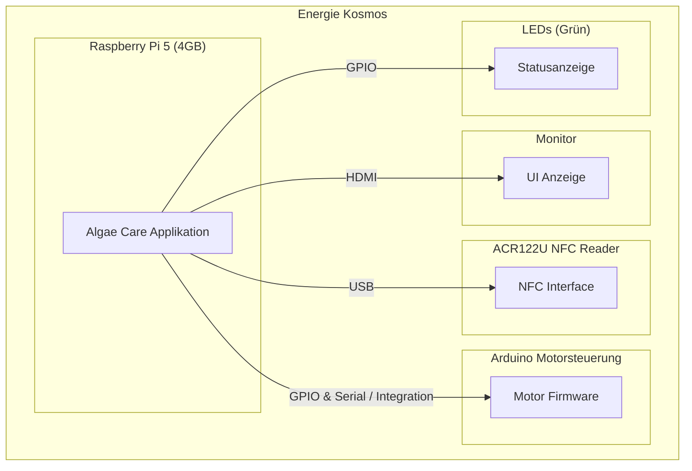

Diese Sicht beschreibt die Umgebung(en), in denen das System laufen wird, sowie die Verteilung der Softwarebausteine auf die physische Infrastruktur.

## 7.1 Infrastruktur Ebene 1

Das System wird ausschliesslich in einer spezifischen Produktionsumgebung am Standort "Energie Kosmos" betrieben. Die gesamte Software läuft auf einem einzelnen Hauptrechner, dem Raspberry Pi 5, an den alle Peripheriegeräte direkt angeschlossen sind.

**Besonderheiten der Umgebung:**

* **Stromversorgung:** Die Umgebung stellt eine stabile Stromversorgung zur Verfügung.
* **Internet/Netzwerk:** Es ist **keine** Internet- oder Netzwerkverbindung verfügbar.
* **Sonstiges:** Es gibt keine weiteren bekannten Besonderheiten dieser Umgebung.

Die gewählte Infrastruktur mit einem zentralen Raspberry Pi und direkt angeschlossenen Peripheriegeräten ist auf die spezifischen Anforderungen des Systems und die Gegebenheiten am Einsatzort zugeschnitten. Sie ermöglicht eine kompakte, in sich geschlossene Lösung, die ohne externe Netzwerkverbindungen auskommt. Die Integration aller Softwarekomponenten auf einem einzigen Rechner reduziert die Komplexität der Verteilung und Kommunikation zwischen den Komponenten.

## 7.2 Infrastruktur Ebene 2

Die Haupt-Hardwarekomponenten in dieser Umgebung sind:

* **Raspberry Pi 5 (4GB RAM):** Dient als zentrale Verarbeitungseinheit, auf der die gesamte Software läuft.
* **ACR122U (NFC Reader):** Wird zum Lesen von NFC-Chips verwendet.
* **Arduino - Motorsteuerung inkl. Schrittmotor:** Steuert die Schrittmotoren für die mechanischen Elemente des Systems.
    * Artikel-Nr.: ARD STEP MOTOR2
    * EAN/GTIN: 0732388662203
    * Hst.-Teile-Nr.: 333250
* **Bildschirm (Raspberry Pi Monitor (Red/White)):** Dient zur visuellen Ausgabe.
    * Integration: Im Gehäuse montiert.
    * Verbindung: Angesteuert via HDMI vom Raspberry Pi.
    * Status: Funktion vollständig gegeben.
* **LEDs (Grün, 3 mm, bedrahtet, 74 mcd, 38°):** Werden für visuelle Indikatoren verwendet.

### 7.3 Abbildung von Software-Bausteinen auf Hardware

Alle Softwarebausteine des Systems laufen auf dem **Raspberry Pi 5**. Sie sind als Teil der einzelnen Algae Care Applikation implementiert und werden gemeinsam auf dieser Hardware ausgeführt.

Die Abbildung der Softwarebausteine auf die Hardware sieht somit wie folgt aus:

| Software-Baustein (gemäss Abschnitt 5) | Zugeordnete Hardware-Komponente |
| :------------------------------------- | :---------------------------------- |
| Gesamte Algae Care Applikation         | Raspberry Pi 5                      |
| NFC-Handling-Logik                     | ACR122U (über Raspberry Pi)         |
| Motorsteuerungs-Logik                  | Arduino - Motorsteuerung (über Raspberry Pi) |
| Grafische Benutzeroberfläche / Anzeige | Bildschirm (über Raspberry Pi)      |
| LED-Steuerung                          | LEDs (über Raspberry Pi)            |

### 7.4 Verbindungen zwischen Hardware-Komponenten

Die physischen und logischen Verbindungen zwischen den Hauptkomponenten sind wie folgt realisiert:

* **Bildschirm <-> Raspberry Pi:** Physisch verbunden über ein **HDMI**-Kabel.
* **NFC Reader <-> Raspberry Pi:** Physisch verbunden über **USB**. Die Kommunikation erfolgt logisch über das **pcsc** (Personal Computer/Smart Card) Framework.
* **LEDs <-> Raspberry Pi:** Physisch verbunden über **GPIO Pins** (General Purpose Input/Output).
* **Arduino Motorsteuerung <-> Raspberry Pi:** Die Verbindung und Steuerung der Arduino-Motorsteuerung erfolgt **via Software** über den Raspberry Pi. Die genaue Implementierung der Software-Integration ist in den vorherigen Kapiteln (insbesondere zur Implementierungssicht) beschrieben.

### 7.5 Netzwerkkonfiguration

Da keine Internet- oder Netzwerkverbindung in der Betriebsumgebung gegeben ist, gibt es keine externe Netzwerkkonfiguration für das System. Interne Verbindungen (z.B. zwischen Raspberry Pi und Peripheriegeräten) sind in Abschnitt 7.4 beschrieben.