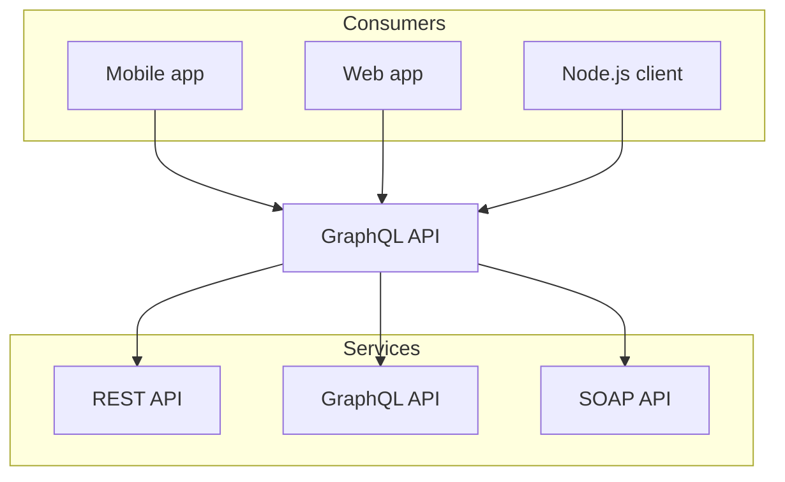

# Technischer Kontext

## Inhalt
Technische Schnittstellen (Kanäle, Übertragungsmedien) zwischen dem System und seiner Umwelt.
Zusätzlich eine Erklärung (_mapping_), welche fachlichen Ein- und Ausgaben über welche technischen Kanäle fließen.

## Motivation
Viele Stakeholder treffen Architekturentscheidungen auf Basis der technischen Schnittstellen des Systems zu seinem Kontext.

Insbesondere bei der Entwicklung von Infrastruktur oder Hardware sind diese technischen Schnittstellen durchaus entscheidend.

## Form
Beispielsweise UML Deployment-Diagramme mit den Kanälen zu Nachbarsystemen, begleitet von einer Tabelle, die Kanäle auf Ein-/Ausgaben abbildet.

optional: Erläuterung der externen technischen Schnittstellen

Mapping fachliche auf technische Schnittstellen
