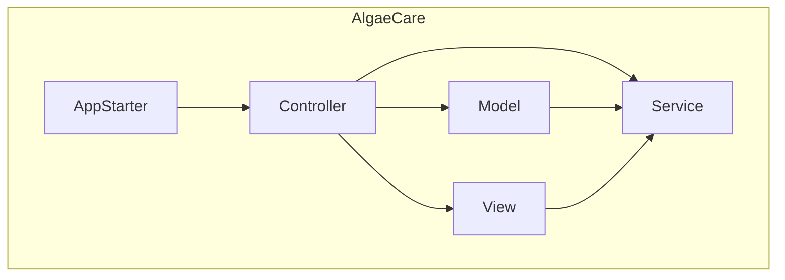
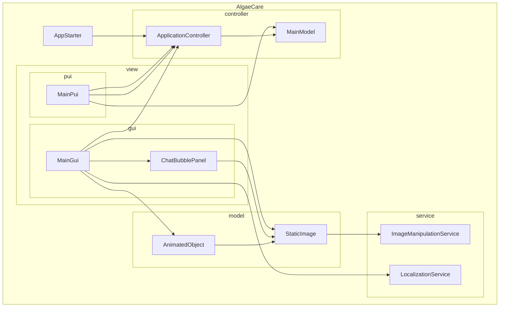
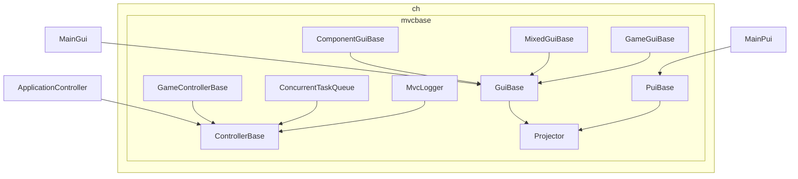
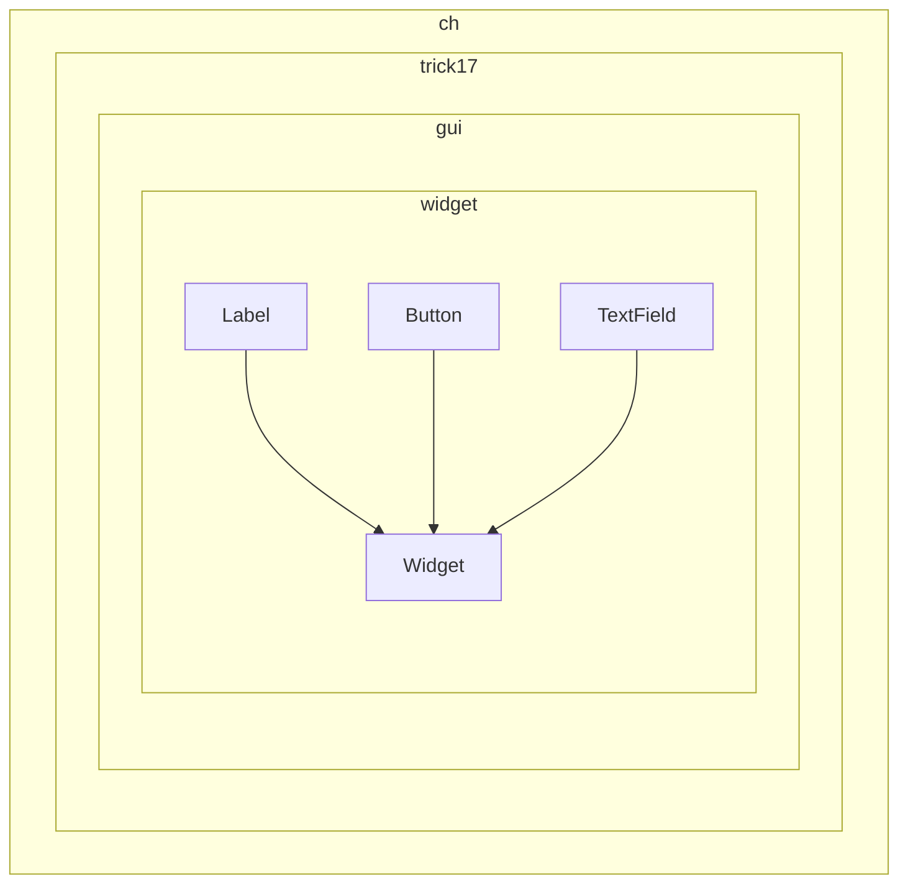
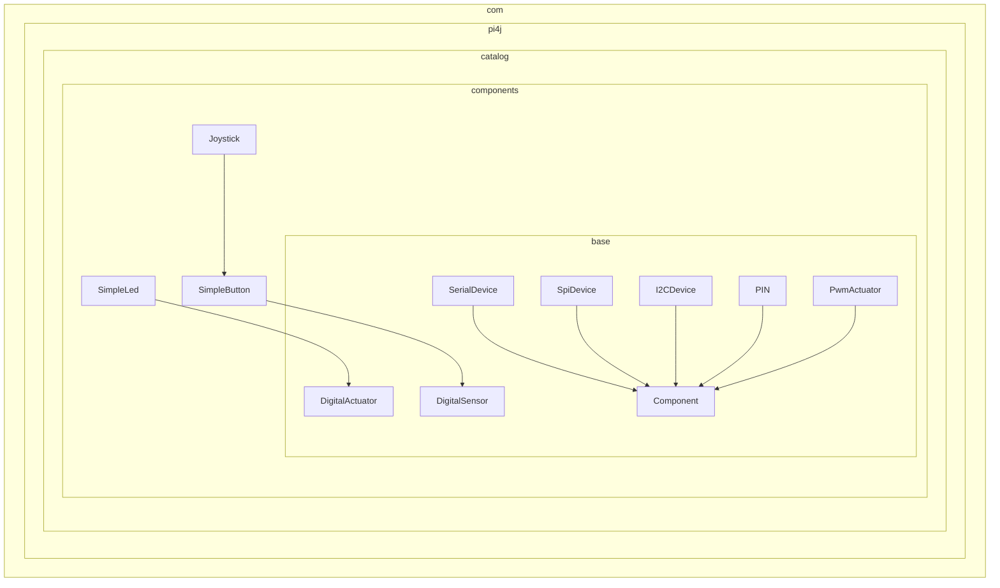
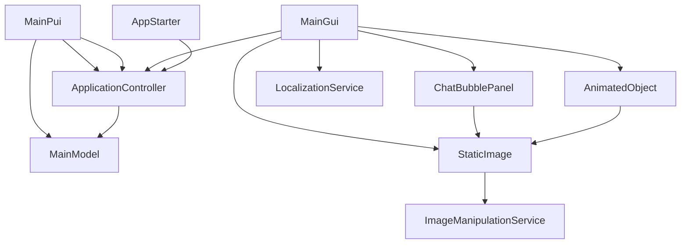

(hier genügt eine einfache Darstellung auf Ebene Pakete und Klassen)

# Bausteinsicht

Dieser Abschnitt beschreibt die Zerlegung von Algae Care in Module, die sich in der Paketstruktur des Java-Quelltextes widerspiegeln. Die Module der ersten Zerlegungsebene bezeichnen wir in Algae Care als Subsysteme. Diese Subsysteme bilden die grundlegenden Bausteine der Anwendung und definieren deren Verantwortlichkeiten sowie die Schnittstellen zur Interaktion miteinander.

Die Ebene 1 stellt die Subsysteme dar, einschließlich ihrer Schnittstellen und Abhängigkeiten. Für das zentrale Subsystem Eingabe- und Verarbeitungssystem enthält dieser Überblick auch eine detailliertere Zerlegung in Ebene 2, um die innere Struktur und Funktionsweise genauer zu erläutern.

Diese Darstellung dient dazu, die Modularität und die klare Trennung der Verantwortlichkeiten im System aufzuzeigen, wodurch die Wartbarkeit und Erweiterbarkeit von Algae Care gewährleistet wird.

## Subsysteme (Ebene 1)

## Eingabe- und Verarbeitungssystems (Ebene 2)

### Main Application Components

### Core MVC Framework Components

### GUI Widgets

### Pi4J Hardware Components

### Interconnections Between Components

