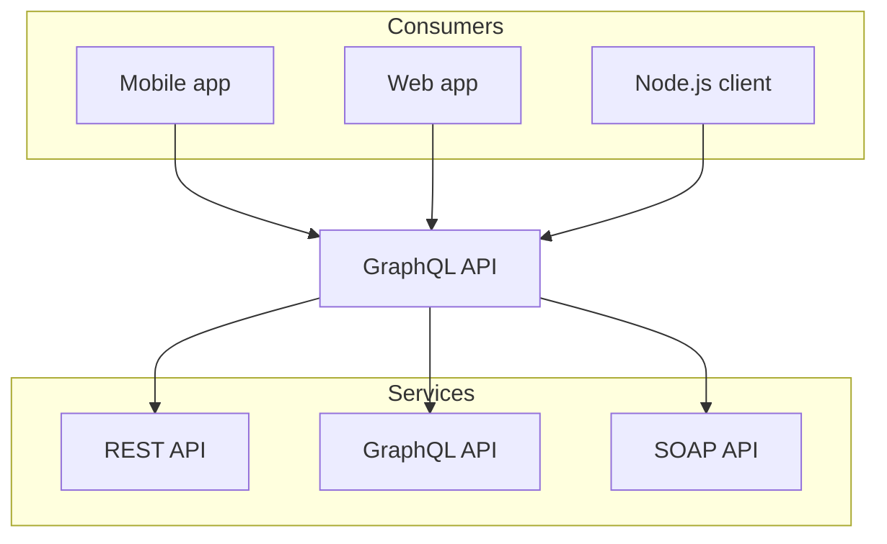

# Fachlicher Kontext

## Inhalt
Festlegung *aller* Kommunikationsbeziehungen (Nutzer, IT-Systeme, ...) mit Erklärung der fachlichen Ein- und Ausgabedaten oder Schnittstellen.
Zusätzlich (bei Bedarf) fachliche Datenformate oder Protokolle der Kommunikation mit den Nachbarsystemen.

## Motivation
Alle Beteiligten müssen verstehen, welche fachlichen Informationen mit der Umwelt ausgetauscht werden.

## Form
Alle Diagrammarten, die das System als Blackbox darstellen und die fachlichen Schnittstellen zu den Nachbarsystemen beschreiben.

Alternativ oder ergänzend können Sie eine Tabelle verwenden.
Der Titel gibt den Namen Ihres Systems wieder; die drei Spalten sind: Kommunikationsbeziehung, Eingabe, Ausgabe.

optional: Erläuterung der externen fachlichen Schnittstellen
